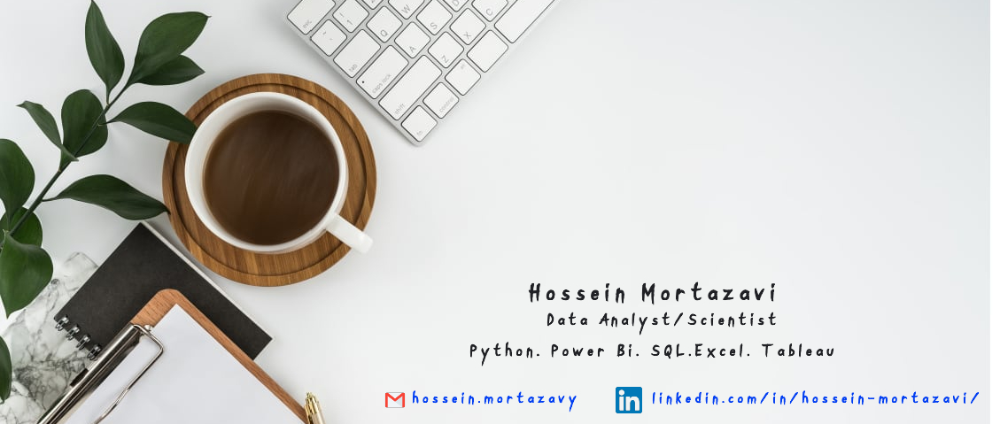

### 🙋🏻‍♂️ Introducing Myself

Hello, I'm Hossein. Data Analyst & Scientist focus on business analytics with +10 years of experience in differnt industries. 
Currenlty Data scientist @Haut.ai

* Advance data anlysis with Python mostly with Pandas and Plotly
* Querying data using SQL.
* Generate reports and perform ad-hoc data analysis using SQL.
* Developing dashboards on PowerBi, Streamlit, Tableau and Looker Studio.
* Data analysis and reporting using Google Sheets and Excel.

🛠️ Tools

* Language: Python, SQL
* Database: Google BigQuery, PostgreSQL, MySQL , Vertica
* Visualization: PowerBi, Streamlit,Tableau, Looker Studio

Confronces:
* Pydata Yerevan 2022 :<a href="https://pydatayerevan.aua.am/presentations/#:~:text=Video-,HOSSEIN%20MORTAZAVI,-Presentation" target="_blank" )website(</a) <a href="https://www.youtube.com/watch?v=IRr3gx71rnk&list=PLGVZCDnMOq0qWwVVDmdOw6oxAlqqH8Ca-&index=44" target="_blank")Youtuebe </a>
* PyCon Estonia 2023 : [website](https://2023.pycon.ee/#:~:text=1%20%40%2014%3A40-,Hossein%20Mortazavi,-Workshop!)

👋🏻 Connect with Me

[linkedin](https://www.linkedin.com/in/hossein-mortazavi/)

<!--
**h0ssein2011/h0ssein2011** is a ✨ _special_ ✨ repository because its `README.md` (this file) appears on your GitHub profile.

Here are some ideas to get you started:

- 🔭 I’m currently working on ...
- 🌱 I’m currently learning ...
- 👯 I’m looking to collaborate on ...
- 🤔 I’m looking for help with ...
- 💬 Ask me about ...
- 📫 How to reach me: ...
- 😄 Pronouns: ...
- ⚡ Fun fact: ...
-->
